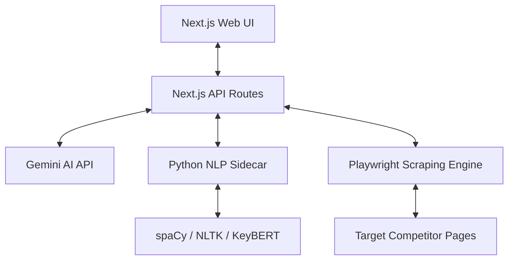

# Blog Post Generator & SEO Intelligence Suite

An advanced, multi-stage content generation and SEO intelligence pipeline built with Next.js, FastAPI, Playwright, and Gemini AI. This tool scrapes search engine results (SERP) for target keywords, extracts competitive terms and entities, and programmatically generates, validates, and polishes human-grade articles that satisfy strict word count, readability, and link-quality criteria.

---

## 🚀 System Architecture



The system is split into two primary components:
1.  **Frontend & Main Backend API (Next.js)**: Manages the React-based user interface, generation wizard, link resolution, local section budgets, and final article assembly.
2.  **NLP sidecar service (FastAPI)**: Performs heavy natural language processing, including 3-tier SEO keyword extraction, semantic scoring, Jaccard paragraph similarity check, and competitor gap scoring.

---

## ✨ Features Built

### 1. Dynamic Budget & Writing Engine
*   **Dynamic Word Budgets**: Section budgets are allocated dynamically based on their type (e.g., target 275 words for H2s, 170 for H3s, 95 for FAQs, and 200 for comparison tables) to avoid bloating or text thinning.
*   **Incomplete Sentence Detection**: Validates that no paragraph ends in trailing ellipses (`...` or `…`), dangling prepositions, or incomplete conjunctions, triggering local retries if found.
*   **Anti-AI Fingerprinting**: Filters out boilerplate AI phrases (e.g., *"Understanding X"*, *"Strategic Integration"*, *"Operational Efficiency"*) to guarantee organic, human-like structure.

### 2. Human Readability & Anti-Stuffing Validator
*   **Flesch Reading Ease**: Enforces a minimum readability score of `55`.
*   **Stylistic Enforcement**: Limits average sentence size to $\le 30$ words and passive voice density to $\le 25\%$.
*   **Plagiarism & Duplication Guard**: Restricts paragraph-level Jaccard similarity to $\le 75\%$, prompting rewrites if structural overlap is found.
*   **Over-Optimization Protection**: Caps keyword density at $3\%$ and limits any individual entity to a maximum of $12$ repetitions.

### 3. Link Quality Engine (LQE)
*   **Domain Authority Scorer**: Dynamically scores external links (e.g., Official docs = 100, Reddit = 60, Ads/Redirects = 0).
*   **Tracking Filter**: Automatically strips tracking queries, redirect links, and UTM codes.
*   **Strict Deduplication**: Limits references to exactly 1 URL per domain/product and a maximum of 15 links overall.
*   **Presentation Blocks**: Groups references under clean markdown categories (*Official Sources*, *Community*, *Documentation*) appended to the conclusion.

### 4. AI Quality Layer
*   **Hallucination Validator**: Cross-checks facts, pricing, features, and integrations via Gemini to flag and repair suspect claims.
*   **Human Style Copyeditor**: Polishes flow, sentence length variation, and transitions while preserving target SEO terms and structural alignments.

### 5. Recent Core Pipeline & UI Updates
*   **Dynamic LLM Budget Allocation**: Dynamically scales the orchestrator's `maxLLMCalls` budget limit using the formula:
    $$\text{allowedLLMCalls} = \text{fixedOverhead} (8) + \text{plannedSections} + \text{maxReviewRetries} (2) + \text{safetyBuffer} (3)$$
    This prevents false budget aborts at ~70% (transition to `REVIEW` stage) for long-form articles while keeping infinite-loop protections active.
*   **Search Call Budget Optimization**: Skips the keyword-discovery expansion block when a valid seed keyword is already provided for single-article generation, preventing the orchestrator from exceeding the target limit of 5 search/SERP API calls.
*   **Workspace Context Alignment**: Ensures the active `currentArticleId` is set when loading legacy outlines and Todo ideas prior to launching the generator wizard, resolving the bug that reset the UI to the Final Configuration page instead of launching the editor.
*   **Autonomous URL Autopilot**: Introduced a single-input autonomous creation flow (Phases 2-14). Users provide their website URL, and the system performs SSRF-safe crawling, constructs a SaaS/Business profile using Gemini structured output, queries candidate search opportunities, scores competitor gaps using SERP intelligence, picks the best target keyword, and initiates the complete writing and review pipeline in one click.
*   **Connected SEO & GEO Competitor Handoff**: Connected competitor references, statistical medians (word count and heading count), deterministic key feature gap checks, and GEO visibility recommendations directly into the section generation prompts. Appends explicit intelligence writing constraints in the section editor prompt (enforcing *differentiation, not copying*). Added proper statistical median math and robust token-overlap gap matching.

---

## 🛠️ Getting Started

### Prerequisites
*   Node.js (v18+)
*   Python (3.11+)

### 1. Starting the Python NLP Sidecar
Navigate to the `nlp-service` directory, activate the virtual environment, and start the FastAPI server:

**Windows (PowerShell):**
```powershell
cd nlp-service
.\.venv\Scripts\activate.ps1
uvicorn main:app --host 127.0.0.1 --port 8000 --reload
```

**macOS / Linux:**
```bash
cd nlp-service
source .venv/bin/activate
uvicorn main:app --host 127.0.0.1 --port 8000 --reload
```

### 2. Starting the Next.js App
In the root directory, install Node dependencies and run the development server:

```bash
npm install
npm run dev
```

Open [http://localhost:3000](http://localhost:3000) to access the Blog Generator interface.

---

## ⚠️ Known Issues & External Limitations

### 1. Vercel Serverless Timeout Limits (504 Gateway Timeout)
Standard Vercel serverless functions timeout at `10 seconds` (Hobby) or `300 seconds` (Pro). Because our generation pipeline parallelizes section writing, executes multi-pass readability repairs, runs hallucination detection, and performs copyediting, the entire process takes **4 to 8 minutes**. In production, this requires background job queue workers or serverless platforms with extended execution limits.

### 2. Third-Party Search & Scraping API Quotas
*   **Google Search / Serper API**: Restricted daily/monthly search credit limits. If exhausted, the engine falls back to ScrapeBadger or pre-defined static URLs.
*   **YouTube Data API**: Daily API quotas are limited (10,000 units), which can be depleted rapidly when fetching media references for multiple articles.

### 3. LLM Rate Limits (429 Too Many Requests)
Making dozens of concurrent calls to the Gemini API during parallel section generation and repair loops can trigger Tokens Per Minute (TPM) and Requests Per Minute (RPM) rate limits, resulting in local fallback mock content.

### 4. Competitor Scraping Blocks
Playwright connections originating from hosting providers (like Railway, AWS, or DigitalOcean) are frequently flagged by anti-bot services (Cloudflare, CAPTCHAs, Akamai), which may result in incomplete SERP gap data.
